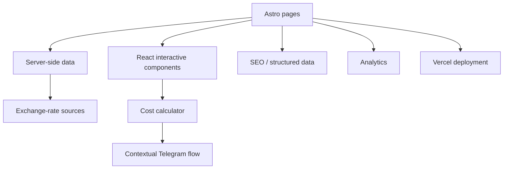

# China Auto Import — Product Case Study

> Commercial web product for a real business importing cars from China.

**Status:** active private project · this repository is a public case study  
**Role:** product design, AI-assisted development, UX, implementation, iteration  
**Core stack:** Astro · React · TypeScript · SSR · Tailwind CSS · Vercel · external APIs · analytics

## The problem

Buying a car from another country is a high-trust purchase. A customer needs more than a catalogue: they need to understand the real cost, what can change during delivery and customs, how the process works, and what happens after they decide to ask for help.

The product is designed around reducing that uncertainty rather than simply presenting inventory.

## User journey

## What I built

### Cost calculator

The calculator is a server-rendered product page rather than a static marketing widget. Exchange-rate data is loaded server-side so the visitor receives current calculation inputs without relying on a client-side request.

The experience also explains why an estimate can change instead of pretending that an international purchase has a perfectly fixed final number.

### Context-aware conversion flow

A generic contact button often opens an empty messenger conversation and forces the customer to decide what to write.

The site carries page context into the first Telegram message. Someone coming from the calculator can ask to verify the calculation; other pages can provide their own relevant starting context.

The implementation is small, but the product goal is important: reduce friction at the point where interest becomes a conversation.

### Search, analytics, and trust infrastructure

The product includes canonical URLs, Open Graph metadata, Schema.org structured data, sitemap support, analytics, and educational content built around questions customers have before purchasing.

## Architecture

## Product approach

I approached the project as a sales and trust product rather than a frontend exercise. Features are evaluated by the customer problem they solve: uncertainty about price, fear of hidden costs, confusion about the purchase process, or friction before contacting a manager.

The calculator, educational content, contextual messaging, and analytics are therefore parts of one user journey rather than disconnected website features.

## AI-assisted development

Claude Code is my primary development tool. I define the business problem and expected behavior, use AI to accelerate implementation, inspect the actual result, debug failures, and iterate on both the product and code.

## Source availability

The full repository remains private because this is an active commercial project and contains business-specific implementation details and production configuration. This public case study documents the product thinking, architecture, and technical work without exposing private business assets.

## Related

[Back to my GitHub profile](https://github.com/finfreedom)
